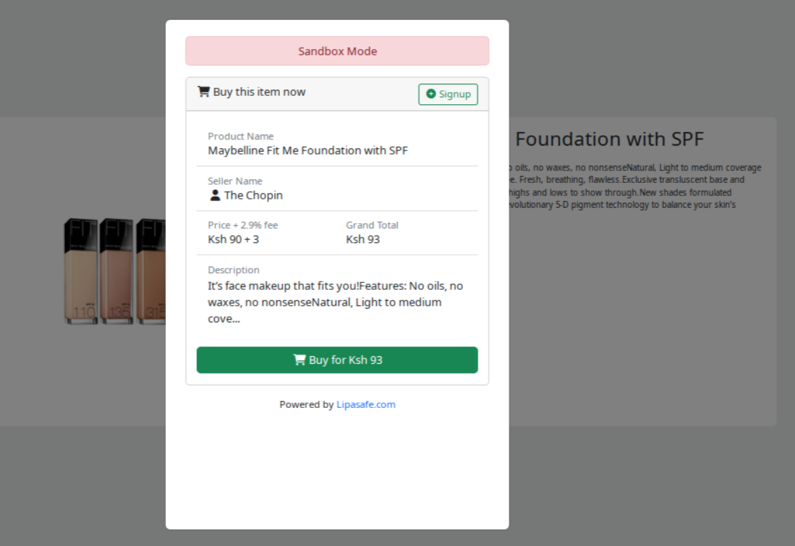
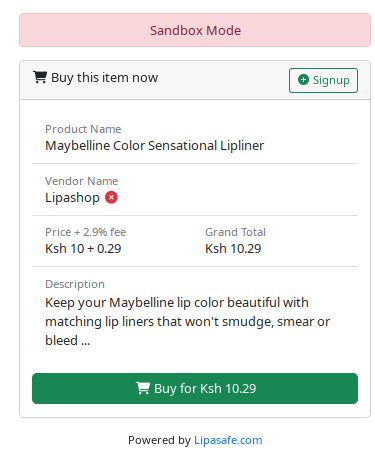

# The iFrame Integration Process

The Lipasafe allows you to use an iframe to embed the escrow payment page into your website.
This allows the buyer to easily setup an Lipasafe escrow transaction  without ever leaving 
your website. The user experience has also been optimized to reduce the number of payment steps.



## How it works
1. Website visitor (buyer) loads a product details page. Inside the page is an iFrame embedded 
in showing the Lipasafe payment widget. This widget is the gateway to Lipasafe escrow service.
2. Buyer clicks the Buy Button in the widget.
3. Buyer logs into their Lipasafe account, while inside the iFrame.
    - The buyer must already have an active Lipasafe user account.
    - Login is performed using a one-time-pin (OTP) sent to the buyer's registered email and telephone number.
    - The OTP access to a customer account will expire in 10 minutes
4. On successful login, an escrow account is automatically created for this transaction. 
Buyer then deposits the full amount into the escrow account.
    - Buyer will receive a payment request on their MPESA number.
    - This payment will be held in the escrow account where the buyer cannot withdraw it 
    without first cancelling the transaction
    - Buyer will receive a payment confirmation from Lipasafe via SMS and email.
    - Buyer will receive a payment link, which when clicked will authorize Lipasafe to send the
    escrow account balance to the seller.
5. Once payment is received in the escrow account, Lipasafe will do the following:-
    - Notify seller of the order placed by buyer via SMS and email
    - Follow up on order notifications to seller every 6 hours
    - Send safety information to both buyer and seller for their education.
    - Send buyer the seller's contact information so they may arrange and exchange.
    - Send seller the buyer's contact information so they may arrange and exchange.
    - Send an Instant Payment Notification (IPN) to back the vendor website
    - IPN is sent to the pre-registered Nofity URL field provided in your **Vendor Dashboard**.
    - IPN messages will be retried upto 3 times before they are marked as failed.
    - You can manually retry IPN messages from your **Vendor Dashboard**
6. The seller delivers the goods / services to the buyer
7. Buyer clicks payment link and authorizes Lipasafe to release the escrow balance to the seller.
    
The benefit of using this integration is that the integration is seamless and the customer never 
leaves your website. You also increase the security of your customer by giving them an option 
to recover their money in case the seller is unable to deliver, or does not deliver as per the 
required quality standard.

## Steps to follow
> **iFrame Endpoint <br>**
> https://mobile.lipasafe.com/paywall

We recommend embedding this iFrame in a product details page. 

All parameters to this URL endpoint **MUST** be URL encoded. In PHP, you can use the ```urlencode()``` function. 
If you are integrating in another language, please find a ```urlencode``` alternative to do this.

Your iFrame ```src``` URL will take the following parameters:-

- Product name - ```name```
- Transaction description - ```description```
- Price - ```price```
    - In KES currency. If ```float```, will be rounded up to nearest integer
    - For example, 9.99 will be rounded up to 10
- Vendor UUID - ```vendor_uuid```
    - You will get this value from your vendor details page
- Inspection period - ```inspection_period```
    - Measured in days
    - Read more [about inspection periods here](/overview/how-it-works/#what-is-the-inspection-period)
- Category (product / service) - ```category```
    - Can either be ```PRODUCT``` or ```SERVICE```

### Example Integration
Here is an example of building the paywall URL in PHP.
```php
$params = [
    'name'              => $product['name'],
    'description'       => $product['description'],
    'price'             => $product['price'],
    'vendor_uuid'       => request()->vendor_uuid,
    'inspection_period' => 5,
    'category'          => 'PRODUCT',
];
$paywallURL = 'http://127.0.0.1:8000/paywall?'.http_build_query($params);
```  
The final URL will look like this:-
```
https://mobile.lipasafe.com/paywall?name=Samsung%20S9&description=Best%20device%20for%20life&desc
&price=30999&vendor_uuid=9a627473-c0f0-4740-8a71-f61af726ff22&inspection_period=3&category=PRODUCT
&notify_url=http%3A%2F%2Fyourwebsite.com%2Fipn%2Freceive
```

### Play with the demo
You can access the **Demo Shop** from the **Vendor Details** >> **View Demo Shop**.

