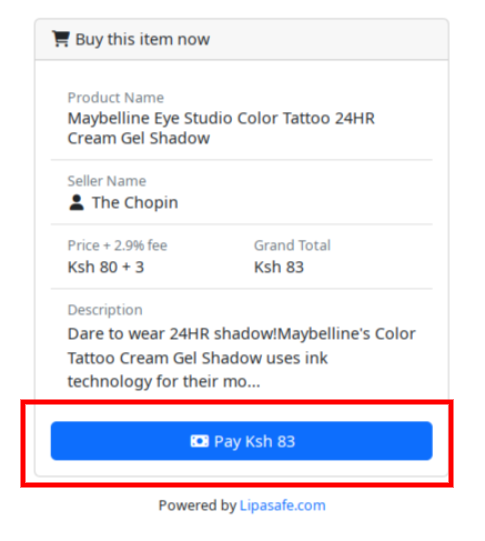
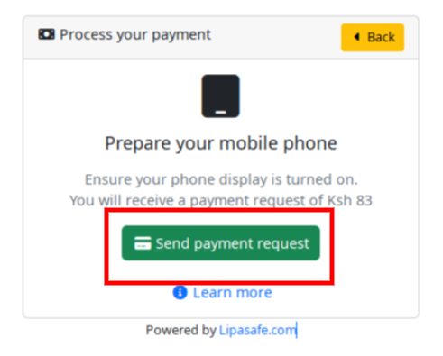
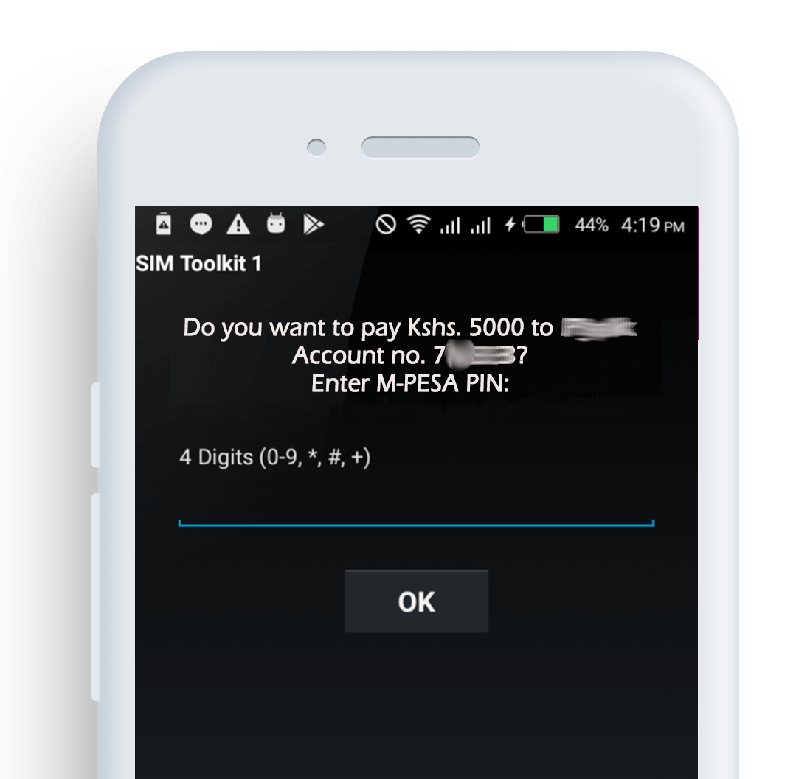
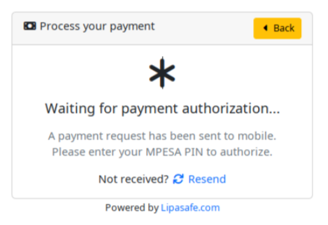

# How do I pay?

Payments on Lipasafe use MPESA STK push. To make a payment, you must trigger a 
payment request to you MPESA account.

Please follow the following instructions to pay:-

1. Unlock your mobile phone and leave the screen on
2. Click on **Send Payment Request** button in the widget

3. An MPESA payment request with the appropriate amount filled in appear on your mobile phone

4. Enter your MPESA PIN to authorize the payment.

5. After payment, you should receive a payment confirmation.

Thats it! Your escrow account is funded.