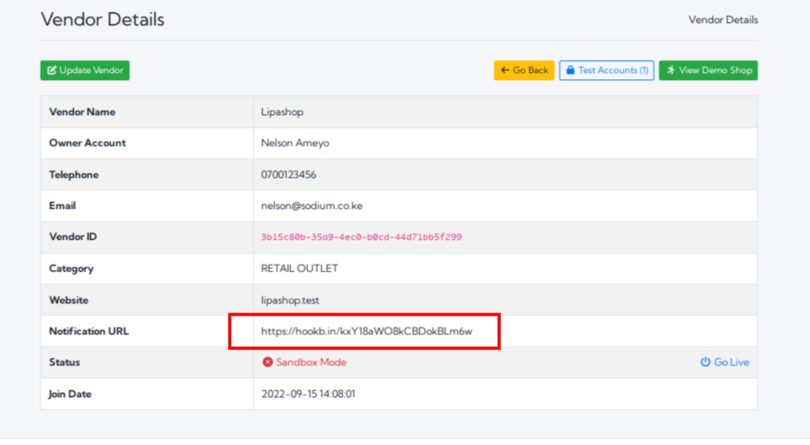

## What is an Instant Payment Notification (IPN)?
It is a copy of the payment information sent to the vendor server when a payment is received on Lipasafe.
The vendor can choose to receive a copy of details about the payment.
This can be important if you wish to perform post-sales actions or just collect and aggregate data 
about sales volumes.

Receiving an IPN is purely optional and not required for a transaction to be processed.
Your IPNs will be sent as a `POST` request to the **Notify URL** you provided in your vendor details page.

If your **Notify URL** is unavailable, the payment notification will be retried upto 3 times before 
abandoning the effort.

If you do not want to receive IPNs, please leave the **Notify URL** field blank.



## Structure of IPN data
You will receive payment data in the following format:-

```json
{
  "id": 129,
  "txn_id": 70,
  "provider": "MPESA",
  "provider_internal_id": "55f62627-6f12-405b-a11d-feeef89cb367",
  "txn_code": "KSNIPIQJ",
  "first_name": "Test",
  "last_name": "Account",
  "amount": 93,
  "sender_phone": "+254700111222",
  "status": "USED",
  "created_at": "2022-09-15T15:16:28.000000Z",
  "updated_at": "2022-09-15T15:16:30.000000Z",
  "segment": "LIPASAFE_IFRAME_API",
  "local_telephone": "0700111222"
}
```