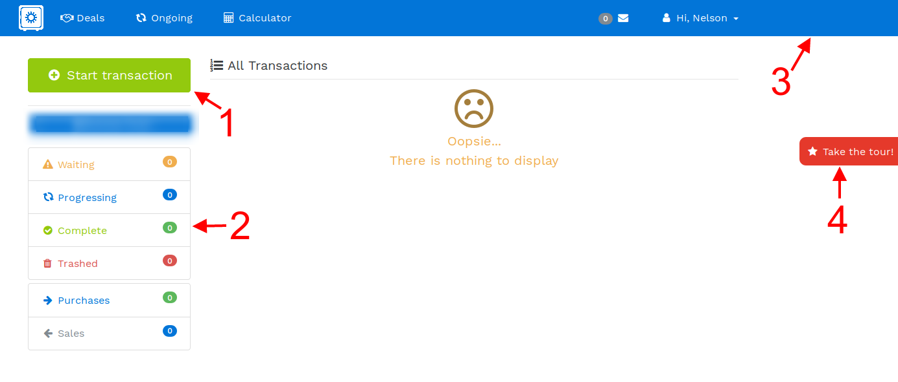

# Understanding the LipaSafe dashboard
After successfully logging in, you will be presented with the **Dashboard**. Understanding this dashboard is essential to making your transaction experience comfortable.
 

> #### 1: Start a transaction
> Click here to start at new transaction
> #### 2: Transaction filters
> Once you have several transactions in different states, you want a way to sort the list without breaking much sweat. Transaction filters to the rescue! You can now sort transactions based on their status(pending / progressing / cancelled / unaccepted) or type (purchase / sale
> #### 3: Navigation bar
> The navbar provides quick access to major parts of your LipaSafe account. Use it to access your transactions, notifications about your deals and profile.
> #### 4: Take the tour
> In case you get lost, click this button to take a tour of that page.

!!! hint "Hint"
    You can access the navbar on any page of the website

!!! info "Information"
    You can find a **Take the tour** button on most pages on lipasafe.com