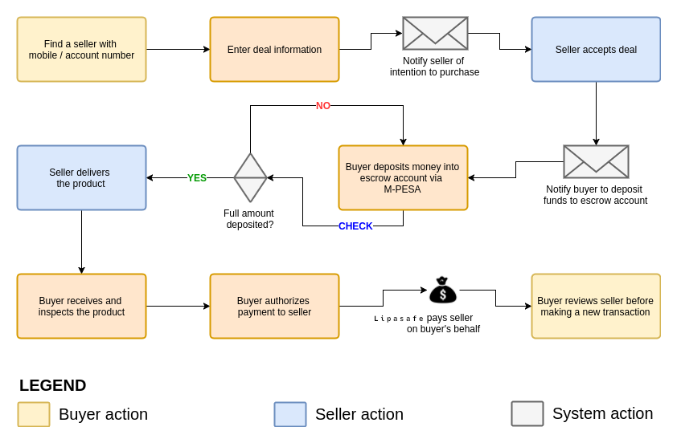

# How does LipaSafe work?
LipaSafe protects buyers and sellers online. Buyers can confidently purchase items from Internet vendors with minimal risk.

##### Step 1: Contact the seller
> The buyer makes contact with the seller and confirms the product/service can be supplied and the seller can accept LipaSafe transactions.

##### Step 2: Start a transaction
> The buyer will start a LipaSafe transaction by entering essential details about the deal. 

> On saving the transaction, an escrow account will be created to facilitate the transaction between the buyer and the seller. 

> The buyer can deposit into the escrow account with M-PESA as soon as the seller accepts the transaction/deal.

##### Step 3: Alert seller
> LipaSafe will notify the seller of the buyer's intent to purchase. The seller will review the transaction to make sure it matches the verbal agreement.

##### Step 4: Accept deal
> If the transaction matches the verbal agreement, the seller will login to their LipaSafe account and accept the buyer's transaction/deal.

##### Step 5 & 6: Deposit funds 
> Once the seller accepts the deal, the buyer will be notified to deposit the agreed amount into the transaction account with Lipa na M-PESA.

> The buyer will deposit the agreed amount into the transaction using Lipa Na M-PESA. LipaSafe will keep monitoring the deposits to the transaction and ensure the full amount is deposited before moving the transaction forward.

> Once money has been deposited from a transaction, it cannot be withdrawn by the buyer when the deal is in progress.

##### Step 7: Delivery / supply
> Once the full amount is deposited into the transaction, LipaSafe will send notify the seller their payment has been locked in. They can now deliver the product/service with confidence that they will get paid on time. 

##### Step 8: Optional shipping
> If the buyer chooses to deliver to their location, extra shipping information MUST be provided. Shipping will have an extra cost implication which will be added to the total value of the deal.

##### Step 9: Inspection
> The buyer will inspect the product/service to ensure it is upto the expected standard. Once inspection is passed, the buyer will authorize payment to be made to the seller's M-PESA number.

##### Step 10: Release funds
> LipaSafe will release the locked funds to the seller via M-PESA. 

##### Step 11: Review process
> After each transaction, both the buyer and seller have to review the completed transaction. This step is a part of our defense protocol to create intelligence that can be reliably used to identify honest sellers from the crooks. Our main goal is to create honest e-commerce and a great service for you

<small>All notifications from LipaSafe are be delivered via SMS and email.</small>
 
<small>All payments into LipaSafe are made via Lipa Na M-PESA til number 599 229</small>
