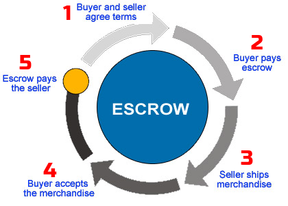

# What is escrow?
An escrow is a financial arrangement where a trusted third party holds and regulates payment of the funds required for two parties involved in a given transaction. It helps make transactions more secure by keeping the payment in a secure escrow account which is only released when all of the terms of an agreement are satisfied.

# An Real World Example

Let us see a real-life example of escrow at work.

Njoki visits an ad-listing website seeking to purchase a used laptop. To understand how risky this purchase can be, lets analyze Njoki's next steps:-

>* She does not know the actual condition of the used laptop
>* She is worried the laptop might be stolen property (very very bad)
>* She has no way of returning the product in case it is defective
>* It is unsafe to carry large amounts of money to a stranger's meeting
>* She cannot warn other buyers in case the seller is dishonest

She  then notices the seller can accept escrow payments, so she sets up an escrow transaction, orders the laptop and requests for delivery to her residence. Upon delivery of the laptop, she unboxes it, inspects its condition and specifications before authorizing payment to the seller. Now, lets analyze these new developments once more and see how things have changed:-

>* She can now verify the condition of the laptop before paying for it
>* The laptop is conveniently delivered to her doorstep
>* She accessed a large sum of cash without visiting a bank teller / ATM
>* She is able to access the seller's information in case of any issues with the purchase e.g. defectiveness, counterfeit brands or criminal incidences
    She is able to review the seller and share her experience with other buyers

You can read more [on Wikipedia](https://en.wikipedia.org/wiki/Escrow)

