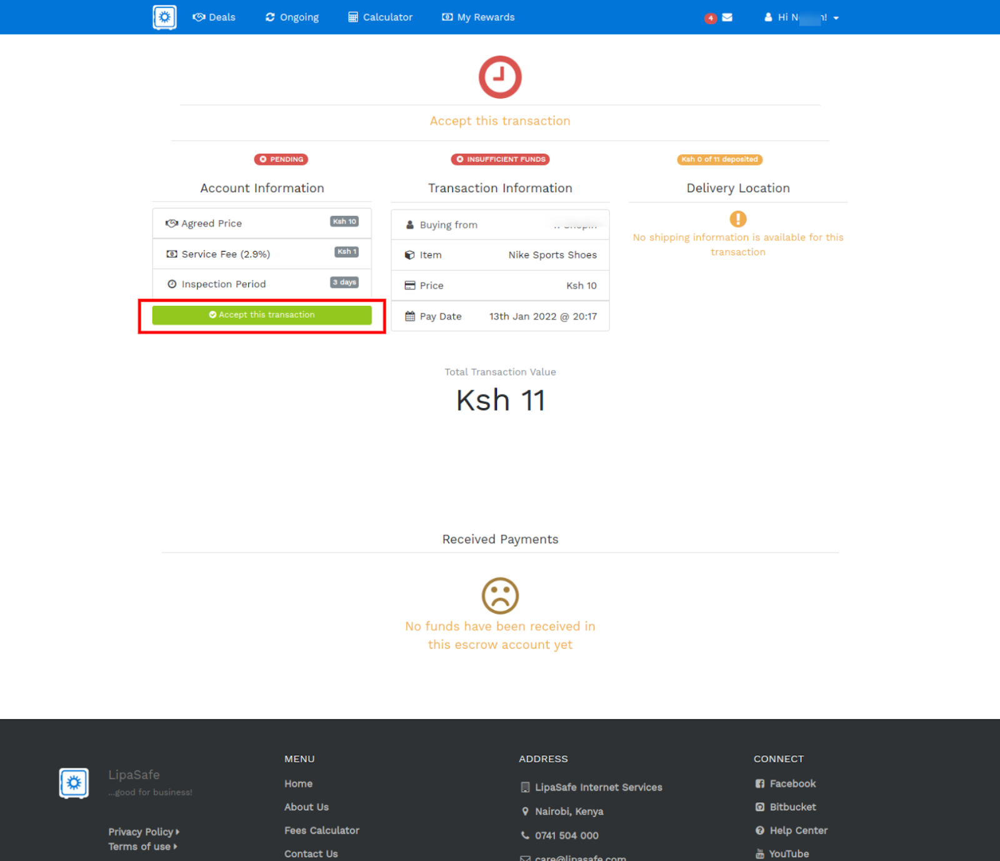

# Seller: Accepting a transaction

Once the transaction has been created, it has to be accepted by the Seller by following the link in their SMS notification. 

This action ensures the Seller can supply the product / service and also allows the buyer to deposit funds.

When the seller accepts the transaction, an SMS and email notification will be sent to the seller with instruction on how to deposit funds into the transaction.
