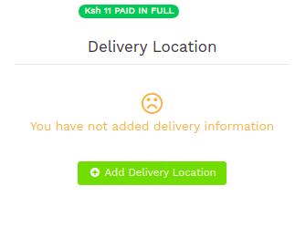
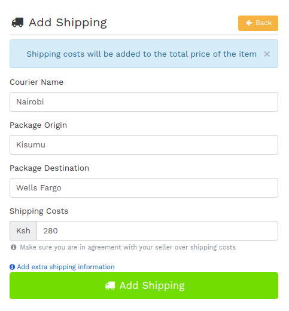

# Buyers: Adding delivery location
Lipasafe.com allows a buyer to add a delivery location to a transaction. Any delivery costs  specified  incurred will be added to the Total Transaction Value which has to be paid by the buyer. Please note, this feature is optional.

To add a delivery location:-

1. Open your transaction view page and click on the Green Add Delivery Location button.

 
2. Fill in the Add Delivery Location Form as required  

3. Once you save the form, you will have to pay the extra amount before the transaction can move to the next step. Please follow the instructions in the [Buyer: Depositing funds into the transaction](/using-lipasafe/depositing-funds) section to complete this step