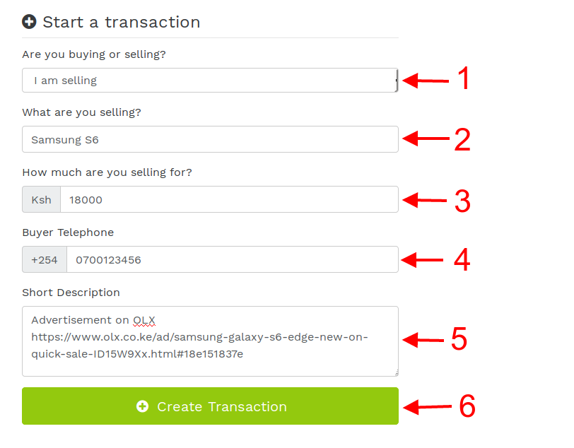

# Starting a transaction¶

1. Select your role in the transaction. You can be a buyer or seller. Always remember:-
    * The money flows from the buyer to the seller
    * The product / service flows from the seller to the buyer
    
2. Complete the rest of the form, keeping in mind the following guidelines:-
    * Clearly describe the product / service to prevent confusion
    * Contact your seller and confirm the sale price 
    * If the other party is not registered with Lipasafe, an invitation will be sent to them. Please communicate this in advance to ensure they onboard and access your transaction
    * You can use the Description section of the form to add extra details about the item / service you intend to purchase. A good way to use this field is copy-pasting details of the product for future reference.
    
3. Once you have filled the form as recommended, click the Green button and you are ready to transact.
4. An SMS and email notification will be sent to the other party notifying them of your intention to buy or sell. For easy access, this notification contains a link to the transaction
5. If you are a buyer, the seller MUST accept the transaction before you can deposit funds into it.
6. If you are the seller, you MUST accept the transaction before the buyer can deposit funds into it.