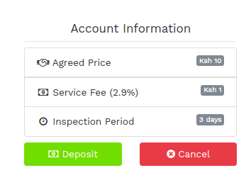
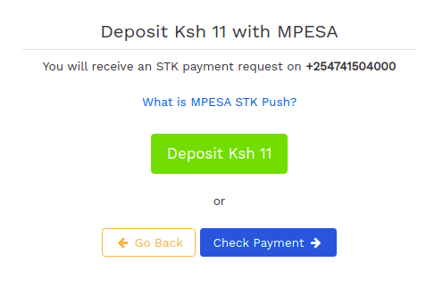
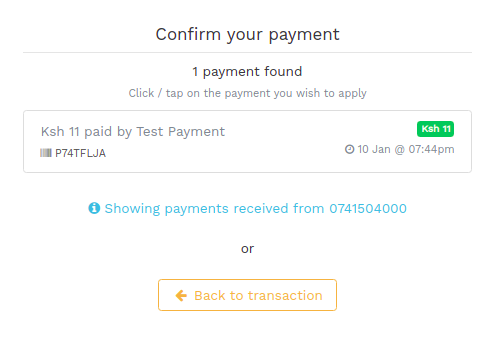
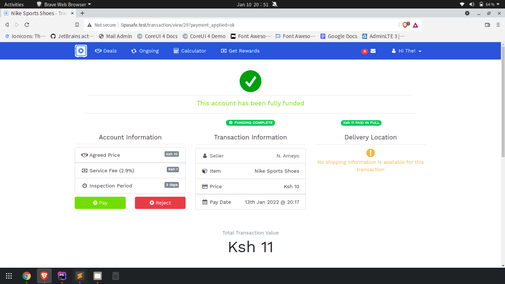

# Buyer: Depositing funds into the transaction

Once the seller accepts the transaction, the Buyer can now deposit the Total Transaction Value with MPESA. This amount will include Lipasafe.com service fees.

Lipasafe.com uses MPESA STK Push to simplify the deposit process. A payment request will be sent to the mobile number you registered with Lipasafe. Please ensure this number is also an MPESA account number.

1. Click on the Green Deposit button.

2. In the following screen, you will be prompted to start the payment process
3. To receive the payment request:-
    * Unlock your phone display / screen and keep it on
    * Click the Green button again to send the payment request to your phone
    * You will be prompted to authorize the payment by entering your MPESA PIN
    * Once you enter your MPESA PIN, ensure you have received an MPESA SMS before moving to the next step 
4. Click on the Blue Check Payment button to detect your payment.
5. You should see your payment automatically displayed in the next screen

6. Click on the payment to apply it to the transaction. You should receive a receipt via SMS and email confirming the payment has been received by Lipasafe.
7. You will be redirected to your transaction and see that the status has changed as illustrated below:-

